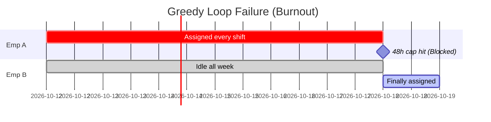

# ADR 001: Greedy Assignment Evaluation

**Context:** The initial prototype used a basic loop to assign shifts. We evaluated it to see if it could handle the baseline constraints (12-hour rest, 48-hour weekly cap).

### The Logic

It uses a straightforward employee-first loop. It finds the first available person and gives them the shift.

```javascript
// Flow: Date -> Employee -> Shift
for (let date of dates) {
	for (let emp of employees) {
		if (isBlocked(emp, date)) continue;

		let shift = getFirstValidShift(emp, date);
		if (shift) {
			assignShift(emp, shift, date);
			break; // Move to next day
		}
	}
}
```

### Why it Failed (The Burnout Problem)

This approach creates a massive workload imbalance. Since the loop always checks the array in order, `Employee A` gets assigned to every single shift until they hit their 48-hour legal limit.

Meanwhile, `Employee B` sits idle all week. Once `Employee A` maxes out their hours or hits the 6-day limit, the roster falls apart, leaving shifts unstaffed.

### Visual: Workload Imbalance


