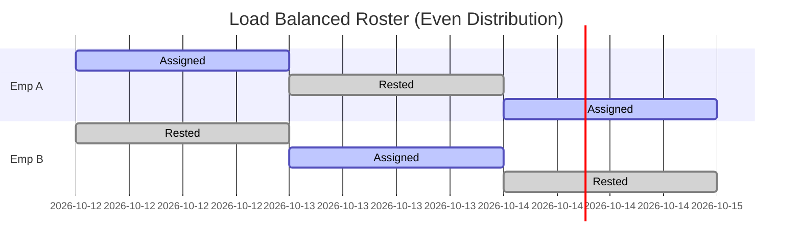

# ADR 002: Heuristic Load Balancing

**Context:** To fix the burnout issue in ADR 001, we need to distribute shifts evenly so no single employee hits the 48-hour statutory limit prematurely.

### The Logic

Instead of looping employees first, we loop the shifts. For each shift, we pool all available employees and sort them by who has worked the least hours that week.

```javascript
// Flow: Date -> Shift -> Sort Candidates
for (let date of dates) {
	for (let shift of shifts) {
		// 1. Get everyone legally allowed to work this shift
		let candidates = getValidEmployees(shift, date);

		if (candidates.length === 0) {
			logError("Unstaffed shift", shift, date);
			continue;
		}

		// 2. Load Balance: Sort by fewest hours worked
		candidates.sort((a, b) => a.hoursWorked - b.hoursWorked);

		// 3. Assign the most rested employee
		assignShift(candidates[0], shift, date);
	}
}
```

### Why it Works (Sustainable Scheduling)

By sorting the candidate pool dynamically, the engine naturally rotates the workforce. If Employee A works Monday, their `hoursWorked` increases. On Tuesday, Employee B will jump to the front of the line.

This guarantees a flat distribution of labor, keeping the entire team well-rested and legally compliant throughout the whole week.

### Visual: Balanced Workload


