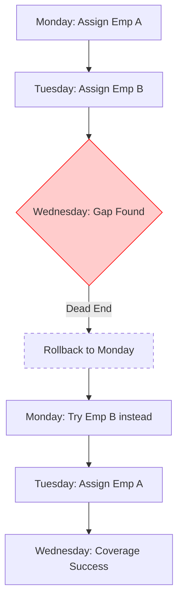

# ADR 003: Recursive Look-Ahead (Backtracking)

**Context:** Load balancing (ADR 002) fixed the burnout issue, but it is "future blind." If an employee goes on leave on Thursday, the engine doesn't know to save the rest of the team's hours early in the week. We needed a way to look ahead.

### The Logic

The standard way to solve this in scheduling is a recursive backtracking algorithm. The engine simulates a path forward. If it hits a dead end (an unstaffed shift) later in the week, it rolls back time, undoes the assignments, and tries a different combination.

```javascript
// Flow: Try Assignment -> Recurse -> If Dead End, Rollback
function assignRecursive(dateIndex, shiftIndex) {
    if (isComplete()) return true; // We staffed the whole roster

    let candidates = getValidEmployees(date, shift);
    
    for (let emp of candidates) {
        assignShift(emp, shift, date); // Try this path
        
        // Move deeper into the future
        if (assignRecursive(nextDate, nextShift)) return true; 
        
        // If the future failed, undo the assignment and try the next person
        removeShift(emp, shift, date); 
    }
    
    return false; // Dead end reached
}

```

### Why it Failed (The Compute Wall)

Though it works perfectly. It is computationally expensive for a server.

Every time we add an employee or a shift, the number of possible combinations multiplies. Trying to recursively schedule a 30-day roster for 50 employees could cause the system to hang and consume too much CPU. A cheaper way to "guess" the future without actually simulating it is needed.

### Visual: The Rollback Cost


