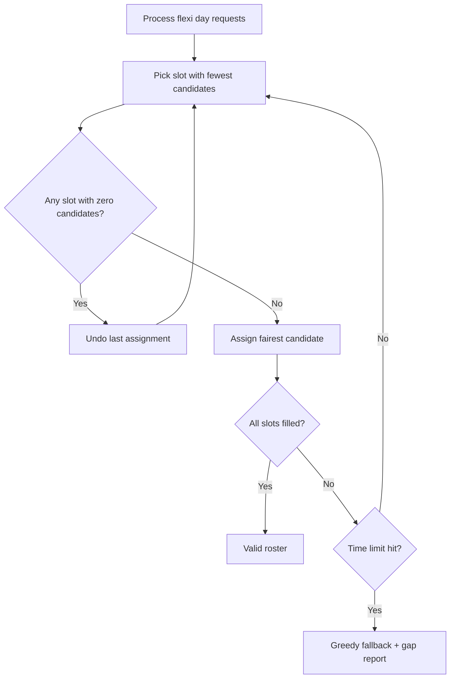

# ADR 004: Smart Backtracking Search

**Context:** ADR 003's backtracking froze the server. It filled shifts in date
order, so when stuck it undid the most recent choice even if the real mistake was
days earlier. It also had to try every combination before admitting a roster was
impossible, and it ran on Node's main thread.

### The Logic

Keep backtracking, but always fill the **hardest slot first** (fewest eligible
people), and undo **immediately** when any open slot has nobody left. The search
runs in a worker thread with a time limit; if it fails, a greedy pass fills what
it can and reports gaps.

```javascript
function search(state, deadline) {
	if (Date.now() > deadline) return TIMEOUT;
	const open = state.slots.filter((s) => !state.assignment.has(s.id));
	if (open.length === 0) return coverageStillPossible(state) ? SOLVED : FAIL;

	// Hardest slot first; stop as soon as any slot has no one left
	let hardest = null,
		hardestCands = null;
	for (const slot of open) {
		const cands = candidatesFor(slot, state);
		if (cands.length === 0) return FAIL;
		if (!hardest || cands.length < hardestCands.length) {
			hardest = slot;
			hardestCands = cands;
		}
	}
	if (!coverageStillPossible(state)) return FAIL;

	for (const emp of rankCandidates(hardestCands, hardest, state)) {
		assign(state, emp, hardest);
		const result = search(state, deadline);
		if (result !== FAIL) return result;
		unassign(state, emp, hardest);
	}
	return FAIL;
}
```

**Fairness** decides who is tried first. Shifts earn unpopular points (night 1,
weekend 1, public holiday 2), and each point counts like 4 extra hours worked.
Someone who supplies a missing supervisor always goes first.

```javascript
const fairnessScore = (emp, cfg) =>
	emp.hours + emp.points * cfg.hoursPerUnpopularPoint;

function rankCandidates(cands, slot, state) {
	return cands
		.map((emp) => ({
			emp,
			helps: suppliesMissingSkill(emp, slot, state) ? 0 : 1,
			fair: fairnessScore(emp, state.cfg),
		}))
		.sort(
			(a, b) =>
				a.helps - b.helps ||
				a.fair - b.fair ||
				a.emp.id.localeCompare(b.emp.id),
		)
		.map((x) => x.emp);
}
```

| Employee | Hours | Unpopular points        | Score | Tried |
| -------- | ----- | ----------------------- | ----- | ----- |
| Sara     | 24    | 0                       | 24    | 1st   |
| Rami     | 16    | 3 (2 nights, 1 holiday) | 28    | 2nd   |

Rami has fewer hours, but his shifts were worse, so Sara goes first.

**Flexi days** are approved first come, first served: denied if the yearly
allowance is used up; otherwise added as leave and the roster is re-solved.
Approved if it still works, denied if the search proves it impossible.

**Leave** is a time period, so any overlapping shift is blocked, including night
shifts crossing midnight. **Supervisor coverage** is checked per time segment
across overlapping shifts, not per shift.

### Why it Works

Filling the hardest slot first means scarce people are placed before easy slots
use them up. Undoing immediately means a bad Monday choice is caught on Monday,
not after trying every Tuesday combination. Together, these turn ADR 003's
exhaustive search into one that usually finishes in milliseconds, and when a
roster truly is impossible, it proves this quickly instead of hanging.

### Visual: The Search



### Visual: Overlapping Shifts

Every 4-hour segment is covered by two shifts. One supervisor on either shift
satisfies that segment.

```mermaid
gantt
    title 6 overlapping 8-hour shifts per day
    dateFormat HH:mm
    axisFormat %H:%M
    section Shifts
    F :f, 02:00, 8h
    A :a, 06:00, 8h
    B :b, 10:00, 8h
    C :c, 14:00, 8h
    D :d, 18:00, 8h
    E :e, 22:00, 8h
```


