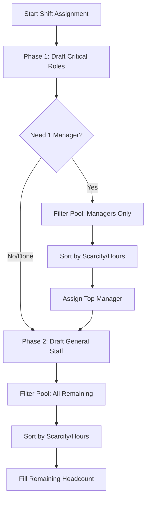

# ADR 005: Role-Based Quotas (Minimum Coverage)

**Status:** Accepted

**Context:** The engine currently just fills headcount. But we can't run a 24x7 manufacturing floor with 5 junior operators and zero managers. We need a way to enforce minimum role constraints (e.g., at least 1 Manager and 2 Techs per shift).

### The Logic

We split the assignment into a two-phase draft.

Before we look at the general labor pool, we loop through the shift's specific role requirements. We filter the candidates by that specific role, sort them using our scarcity score (ADR 004), and assign them. Once the critical roles are locked in, we fill whatever headcount is left with general staff.

```javascript
// The quotas come from the DB (md_shft_req), not hardcoded magic numbers
// Example: shift.reqs = [{ role: 'MANAGER', min: 1 }, { role: 'TECH', min: 2 }]

function draftShift(date, shift, candidates) {
	// Phase 1: Fulfill mandatory role quotas first
	for (let req of shift.reqs) {
		let rolePool = candidates.filter((emp) => emp.role === req.role);

		// Sort using our ADR 004 logic (Hours -z Scarcity Modifier)
		rolePool.sort(scarcitySort);

		for (let i = 0; i < req.min; i++) {
			assignShift(rolePool[i], shift, date);
			removeCandidate(candidates, rolePool[i]); // Take them out of the general pool
		}
	}

	// Phase 2: Fill remaining shift capacity with anyone left
	fillRemainingHeadcount(date, shift, candidates);
}
```

### Why it Works

It guarantees operational safety. If we just dumped everyone into one giant pool and sorted by hours, the engine might accidentally pick all juniors just because they had the fewest hours worked. By prioritizing the quota draft first, we secure the shift's leadership/technical needs, then let the load balancer handle the rest.

### Visual


