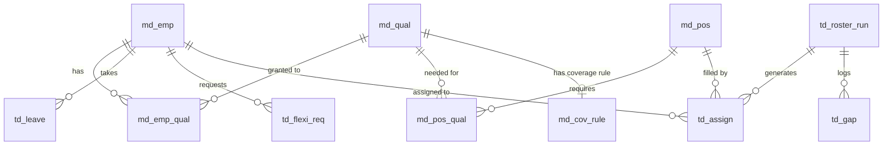

## Master Data

- **md_emp:** Our employees.
- **md_qual:** The list of available skills/qualifications (like "First Aid").
- **md_emp_qual:** The link connecting employees to the skills they hold.
- **md_shift_tmpl:** The daily shift blueprints (e.g., 8 AM start, 8 hours long).
- **md_pos:** The actual jobs/roles we need to fill on a shift.
- **md_pos_qual:** Which skills are mandatory to work a specific position.
- **md_cov_rule:** Global floor rules (e.g., "we always need at least 1 First Aider on site at all times").
- **md_holiday:** A simple calendar of public holidays.

## Transaction Data

- **td_leave:** Approved time blocks where an employee is unavailable.
- **td_flexi_req:** Requests for flexi-days off (tracks if they are pending, approved, or denied).
- **td_roster_run:** The history log of every time we ran the scheduling algorithm (tracks duration and success).
- **td_assign:** The actual final schedule. It connects a specific roster run to an employee and a position for a set time.
- **td_gap:** If the algorithm fails to fill a shift (e.g., literally no one is available), it logs a warning here instead of crashing.

---

## Database Connections

